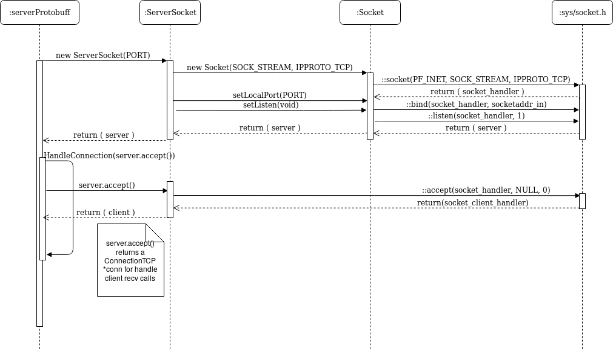

## Object Oriented TCP / IP Socket Model design in C++

#### Socket Abstraction Layer

* mainServer : Modeled to Server end
* connection : Modeled to Client end


#### Classes

- Socket: Socket base class
- ServerSocket: Server socket, TCP by default
- Connection: Establish a socket connection with the given address & port
	- ConnectionTCP: TCP Connection for communicate with a TCP Server
	- ConnectionUDP: UDP Connection for Communicate with a UDP Server
- SocketException: Signal a problem with the execution of a socket call
- SerialPort: Responsible for write/read to serial device
- MotorPort: Interface to control DC Motor
- ServoPort: Interface to control Servo Motor. No yet implemented.
- ServiceLog: Responsible to log all information for debugging purposes. No yet implemented.

#### Applications
- clientConnection.cpp: Client end user space application using a struct for message exchange
- mainServer.cpp: Server end user user space application using a struct for message exchange
- mainServerString.cpp: Server end user space application for handling a string from MD
- clientProtobuff.cpp: Client end user space application using google::protobuf
- serverProtobuff.cpp: Server end user space application using google::protobuf

#### Protocol Buffers
- proto/message.proto:  App level message model used for ::send & ::recv, Length prefix
framing, lenght is in a fixed size, as long as both sides encode the lenght in the same
way, just having the .proto model will do the trick.


#### Host build

```c++
A9-POC $ mkdir build
A9-POC $ cd build
A9-POC $ cmake -DTOOLCHAIN=HOST ..
A9-POC $ make
A9-POC $ ./mainServer <PORT> <SERIAL_DEVICE>
```

#### Target build
```c++
A9-POC $ mkdir build
A9-POC $ cd build
A9-POC $ cmake -DTOOLCHAIN=ARM ..
A9-POC $ make
A9-POC $ ./mainServer <PORT> <SERIAL_DEVICE>
```

#### Host debug
```c++
A9-POC $ mkdir build
A9-POC $ cd build
A9-POC $ cmake -DTOOLCHAIN=HOST -DCMAKE_BUILD_TYPE=Debug ..
A9-POC $ make
A9-POC $ [gdb|cgdb]./mainServer <PORT> <SERIAL_DEVICE>
A9-POC $ [gdb|cgdb]./connection <ADDR> <PORT>
```


#### Setup Connection



#### Read a message

